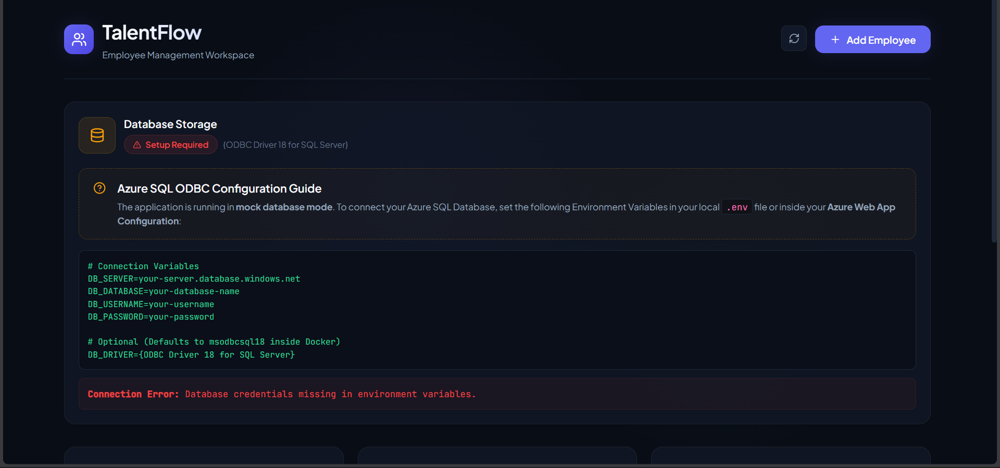
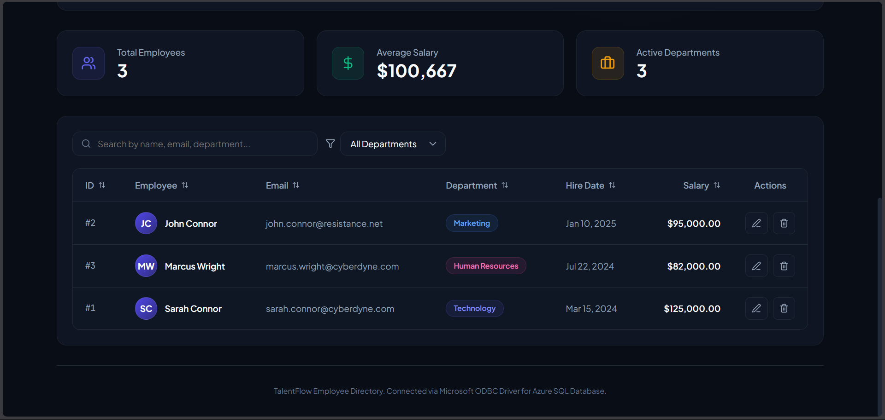

# 🏢 Employee Management System (EMS)

A enterprise-grade full-stack **Employee Management System (EMS)** containerised with **Docker**, provisioned on **Azure** using **Terraform (IaC)**, orchestrated via **Kubernetes (AKS)**, and automatically deployed using a **Jenkins CI/CD Pipeline**.

---

## 📸 Screenshots

> 


---

## 🧱 Tech Stack

| Layer | Technology |
|---|---|
| **Frontend** | React 19 + Vite 8, Lucide React, Nginx |
| **Backend** | Python 3.11, Flask 3, Flask-CORS, Gunicorn |
| **Database** | Azure SQL Server & Database (via pyodbc + ODBC Driver 18) |
| **Containers** | Docker (Backend & Frontend standalone images) |
| **Infrastructure (IaC)** | Terraform (Azure AKS, ACR, VNet, SQL, Key Vault, Log Analytics) |
| **Orchestration** | Kubernetes / AKS (Deployments, Services, ConfigMaps, Secrets, Kustomize) |
| **CI/CD** | Jenkins Pipeline (`Jenkinsfile` with automated k8s rollout) |
| **Registry** | Docker Hub (`ctslab/ems-backend`, `ctslab/ems-frontend`) & Azure Container Registry (ACR) |

---

## 🗂️ Project Structure

```
EMS/
├── backend/                # Python Flask REST API
│   ├── app.py              # Application routes & mock DB fallback
│   ├── database.sql        # Database schema script
│   ├── requirements.txt    # Python package dependencies
│   └── Dockerfile          # Backend Docker container build
├── frontend/               # React (Vite) Single Page Application
│   ├── src/                # UI components & API integrations
│   ├── nginx.conf          # Reverse proxy config for static serving & API forwarding
│   ├── package.json        # Frontend dependencies
│   └── Dockerfile          # Multi-stage Nginx build for React
├── infra/                  # Terraform IaC for Azure Infrastructure
│   ├── main.tf             # Root module orchestration
│   ├── variables.tf        # Input variable definitions (region, SKUs, sizes)
│   ├── outputs.tf          # Provisioning outputs (kubeconfig, connection strings)
│   ├── terraform.tfvars    # Environment configuration
│   └── modules/            # Modular IaC definitions
│       ├── resource_group/ # Azure Resource Group (`rg-ems-dev`)
│       ├── networking/     # VNet & Subnet (`snet-aks`) with SQL Service Endpoint
│       ├── aks/            # Managed AKS Cluster (`aks-ems-dev`)
│       ├── acr/            # Container Registry (`acremsdev`) + AcrPull RBAC
│       ├── sql/            # Azure SQL Server (`emserver`) & DB (`Emdb`) Serverless
│       ├── key_vault/      # Azure Key Vault (`kv-ems-dev`) for credentials
│       └── monitoring/     # Log Analytics Workspace & Container Insights
├── k8s/                    # Kubernetes manifests
│   ├── namespace.yaml      # Dedicated `ems` namespace
│   ├── configmap.yaml      # Non-sensitive app configuration
│   ├── secret.yaml.template # Template for k8s Secret (DB_PASSWORD)
│   ├── backend-deployment.yaml  # Backend deployment (2 replicas) & ClusterIP
│   ├── frontend-deployment.yaml # Frontend deployment (2 replicas) & LoadBalancer Service
│   └── kustomization.yaml  # Kustomize manifest bundle
├── Screenshots/            # Application UI screenshots
├── .env.example            # Local environment variable reference template
├── .gitignore              # Git ignore rules (secrets & terraform state ignored)
├── Dockerfile              # Unified root multi-stage Docker build
├── Jenkinsfile             # Declarative Jenkins CI/CD pipeline script
└── README.md               # Project documentation
```

---

## ⚙️ Architecture

```
                  ┌─────────────────────────────────────────────────────────────┐
                  │                 Azure Cloud (rg-ems-dev)                    │
                  │                                                             │
                  │   ┌─────────────────────────────────────────────────────┐   │
                  │   │        Azure Kubernetes Service (aks-ems-dev)       │   │
  Browser ────────┼──►│  Frontend LoadBalancer (Port 80)                    │   │
                  │   │    └─► Pods (ems-frontend x2)                       │   │
                  │   │          │                                          │   │
                  │   │          ▼ (ClusterIP: ems-backend:8000)            │   │
                  │   │        Pods (ems-backend x2)                        │   │
                  │   └──────────┬──────────────────────────────────────────┘   │
                  │              │                                              │
                  │              ▼ (Secure VNet Endpoint)                       │
                  │   ┌──────────────────────────────┐                          │
                  │   │ Azure SQL Server (emserver)  │                          │
                  │   │   └─► Database (Emdb)        │                          │
                  │   └──────────────────────────────┘                          │
                  └─────────────────────────────────────────────────────────────┘
```

---

## 🏗️ Infrastructure Provisioning with Terraform (IaC)

All Azure resources are defined as modular Infrastructure as Code (IaC) inside [`infra/`](file:///c:/Users/ashuj/Desktop/Cogni/Projects%20Prac/EMS/infra).

### Prerequisites
- [Terraform CLI (v1.6+)](https://developer.hashicorp.com/terraform/downloads) installed
- [Azure CLI](https://learn.microsoft.com/en-us/cli/azure/install-azure-cli) logged in (`az login`)

### Deploy Infrastructure to Azure

1. Navigate to the infra directory:
   ```bash
   cd infra
   ```

2. Initialize Terraform modules:
   ```bash
   terraform init
   ```

3. Set your SQL Admin Password (env variable or prompt):
   ```powershell
   $env:TF_VAR_sql_admin_password="YourSecurePassword123!"
   ```

4. Plan and Apply changes:
   ```bash
   terraform plan -out=tfplan
   terraform apply tfplan
   ```

5. Fetch AKS Cluster Credentials:
   ```bash
   az aks get-credentials --resource-group rg-ems-dev --name aks-ems-dev --overwrite-existing
   ```

---

## ☸️ Kubernetes Deployment (k8s)

The `k8s/` folder contains production-ready Kubernetes manifests designed to run on AKS or any k8s cluster.

### 1. Create the Secret
Copy the secret template and fill in your base64-encoded SQL password:
```bash
cp k8s/secret.yaml.template k8s/secret.yaml
```
Encode your password:
```bash
echo -n "YourActualPassword" | base64
```
Edit `k8s/secret.yaml` and set `DB_PASSWORD` to the generated base64 string.

### 2. Apply Kubernetes Manifests

Apply all resources using Kustomize:
```bash
kubectl apply -k ./k8s
```

Or apply individually:
```bash
kubectl apply -f k8s/namespace.yaml
kubectl apply -f k8s/configmap.yaml
kubectl apply -f k8s/secret.yaml
kubectl apply -f k8s/backend-deployment.yaml
kubectl apply -f k8s/frontend-deployment.yaml
```

### 3. Verify Deployment Status
```bash
kubectl get pods -n ems
kubectl get svc -n ems
```

Copy the `EXTERNAL-IP` from `ems-frontend` service and open it in your browser.

---

## 🔁 Jenkins CI/CD Pipeline

The [`Jenkinsfile`](file:///c:/Users/ashuj/Desktop/Cogni/Projects%20Prac/EMS/Jenkinsfile) defines an automated CI/CD pipeline that builds, tests, pushes Docker images, and deploys updates to Kubernetes.

### Pipeline Workflow

```
Checkout ──► Build Backend ──► Build Frontend ──► Verify Images ──► Docker Login ──► Docker Push ──► Verify Push ──► Deploy to K8s
```

| Stage | Action |
|---|---|
| **Checkout** | Clones code from GitHub repository |
| **Build Backend & Frontend** | Builds isolated Docker images (`ctslab/ems-backend`, `ctslab/ems-frontend`) tagged with `BUILD_NUMBER` |
| **Verify Docker Images** | Inspects built images locally |
| **Docker Login & Push** | Authenticates and pushes images to Docker Hub |
| **Deploy to Kubernetes** | Applies `k8s/` manifests and performs zero-downtime rolling update via `kubectl set image` |

---

## 🚀 Running Locally (Development)

### 1. Configure `.env`
```bash
cp .env.example .env
```

### 2. Backend Setup
```bash
cd backend
pip install -r requirements.txt
python app.py
```
*(Backend runs on `http://localhost:8000`)*

### 3. Frontend Setup
```bash
cd frontend
npm install
npm run dev
```
*(Frontend dev server runs on `http://localhost:5173`)*

---

## 🌐 API Reference

| Method | Endpoint | Description |
|---|---|---|
| `GET` | `/api/status` | Check DB connectivity status |
| `POST` | `/api/setup-db` | Initialize Database table & schema |
| `GET` | `/api/employees` | Get list of all employees |
| `GET` | `/api/employees/<id>` | Get details for a specific employee |
| `POST` | `/api/employees` | Create a new employee |
| `PUT` | `/api/employees/<id>` | Update an existing employee |
| `DELETE` | `/api/employees/<id>` | Delete an employee record |

---

## 📝 License

This project is for educational and enterprise demonstration purposes.
